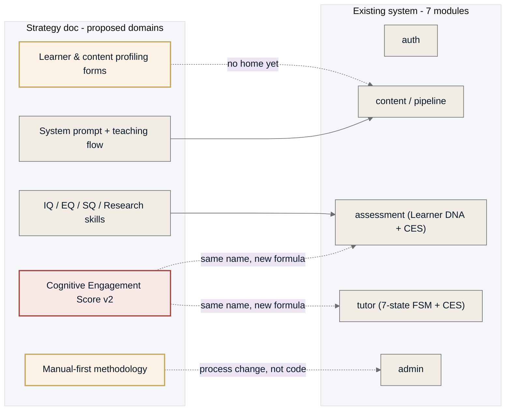
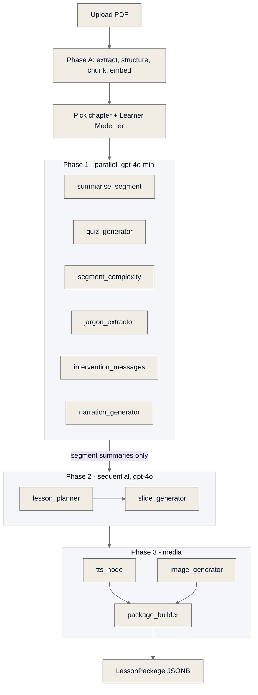
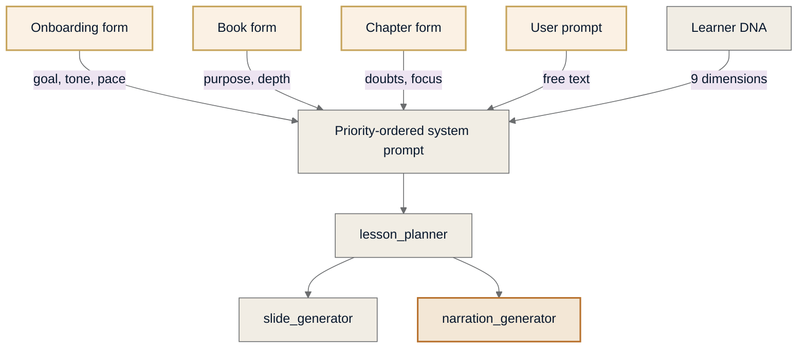
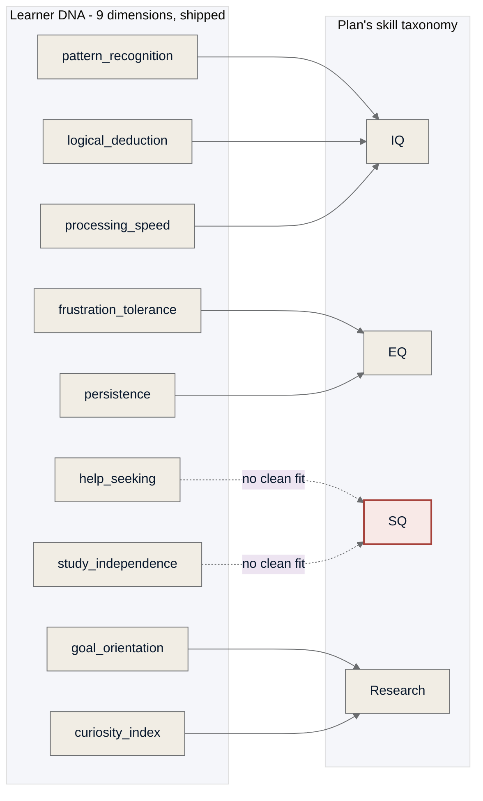
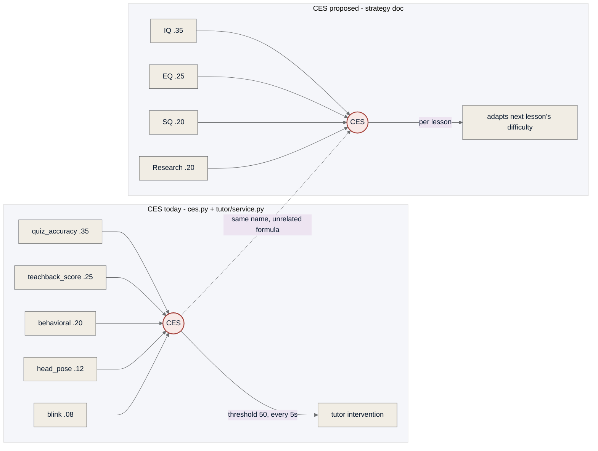

# Plan vs Pipeline

**Eight domains where the *AI Learning Product* strategy doc either extends, duplicates, or collides with what's already built — grounded in the actual pipeline code, not the tracker's claims about it.**

- **Source plan:** `AI_Learning_Product_Final_Strategy.pdf`
- **Build snapshot:** `docs/master-tracker.md`, `docs/ces-decisions-developer-guide.md`
- **As of:** 2026-09-11

---

## Three things to settle before writing any story

1. **"CES" means two different things.** The live formula gating tutor interventions and the plan's skill-growth score share a name and nothing else. See Domain 5.
2. **SQ and Research have no home in Learner DNA.** The 9 shipped dimensions cover IQ and EQ reasonably well; nothing today measures explanation-to-others or evidence-checking. See Domain 4.
3. **Book- and chapter-level intent isn't captured anywhere.** Today's only inputs are a 20-question diagnostic and a duration pick. Three new forms is real, unscoped engineering. See Domain 1.

## Legend

| Symbol | Meaning |
|---|---|
| ● Aligned | Built and matches the plan |
| ◐ Partial | Exists, different shape |
| ○ Net-new | No code today |
| ✕ Conflict | Needs a decision first |

*Where each strategy-doc domain lands on the existing module map. Dotted edges mark domains with no current owner or a name that already means something else.*

---

## 01 · Learner & Content Profiling — `○ net-new`

| Current | Planned |
|---|---|
| A 20-question diagnostic (`OnboardingFlow.tsx`, Story 2-3) scores the 9-dimension Learner DNA profile once, at signup. A 3-card Learner Mode picker (Deep / Balanced / Refresher, Stories S2-07–09) sets duration at upload time. Neither captures a stated goal, a deadline, a preferred tone or pace, or anything about *why* a specific book or chapter was uploaded. | Three layered forms — Onboarding (goal, level, tone, pace), Book (purpose, scope, deadline), Chapter (doubts, focus, expected outcome) — merged into a priority-ordered system prompt, each optional after the first ask. |

> No schema, storage, or UI exists for book- or chapter-level intent. This is the single largest genuinely new engineering surface in the plan — everything else below extends something already built.

---

## 02 · Lesson Generation Pipeline — `◐ exists, shape undecided`

| Current | Planned |
|---|---|
| 11-node LangGraph pipeline, code-verified end to end. Phase 1 (six economy nodes, `gpt-4o-mini`) runs in parallel; Phase 2 (`lesson_planner`, `slide_generator`, `gpt-4o`) runs sequentially on Phase-1 summaries only, never raw text — a hard 5× token-savings rule. Two systemic bugs (reducer-field duplication, TTS-fallback script loss) were found and fixed 2026-07-28/29. | A specific 9-step teaching flow (Introduce → Explain → Simplify → Apply → Ask → Reflect → Correct → Connect → Reinforce) and a 60/40 technical-to-engagement narration ratio. Duration should reshape depth and pacing, not just section count. |

> The nodes exist; none of their prompts encode this structure yet. Dev 1's own backlog already carries an open, unscoped item — **"redesign lesson_planner/slide_generator prompts: plain-language explanations + easy diagrams"** — that this plan would give real content to.

*The pipeline as it runs today. The Phase 1 → Phase 2 handoff is the one architectural rule the plan must not violate: lesson_planner never sees raw chapter text.*

*What the plan would insert upstream of the existing nodes. The 4 new inputs (gold outline) need forms and storage; narration_generator (amber) needs new prompt content, not new code.*

---

## 03 · Media Generation — `● already aligned`

| Current | Planned |
|---|---|
| TTS: Sarvam Bulbul v3 → Azure → Browser. Image: Gemini Nano Banana → GPT Image 2 → text-only. Both fallback chains locked and implemented. A human-recorded-narration node is already an open Dev 1 backlog item, for unrelated reasons. | No new media technology — only a content requirement (slides stay sparse, narration carries the teaching). |

> No action needed here beyond feeding better scripts (Domain 02) into what already exists.

---

## 04 · Skills Model — Learner DNA vs IQ/EQ/SQ/Research — `◐ taxonomy mismatch`

| Current | Planned |
|---|---|
| 9 EMA-fused dimensions in `dna_fusion.py`: `pattern_recognition, logical_deduction, processing_speed, frustration_tolerance, persistence, help_seeking, goal_orientation, curiosity_index, study_independence`. Never surfaced as raw scores. | A 4-pillar taxonomy — IQ, EQ, SQ, Research — each with named activities (teach-back for SQ, evidence-checking for Research). |

> IQ and EQ map cleanly to 3 dimensions each. **SQ and Research don't.** `help_seeking` / `study_independence` are the closest existing signals to SQ but don't measure explaining a concept to someone else, and nothing today scores source-checking or evidence quality.

*Six of nine shipped dimensions map onto IQ or EQ without much argument. SQ (outlined red) is the pillar with no supporting signal today.*

---

## 05 · Cognitive Engagement Score (CES) — `✕ naming collision`

| Current | Planned |
|---|---|
| `quiz_accuracy×.35 + teachback×.25 + behavioral×.20 + head_pose×.12 + blink×.08`. Recomputed every 5s from webcam + quiz/teach-back signals. Gates tutor interventions: 2 consecutive windows below 50 fires a nudge. Weights are env-var-validated to sum to 1.0 at startup. | `IQ×.35 + EQ×.25 + SQ×.20 + Research×.20`. A slower, post-lesson skill-growth composite meant to adapt future lesson difficulty. No attention or webcam component at all. |

> Two unrelated formulas share one name across two teams' mental models. **Resolve before any story references "CES."** Suggestion: keep the name for the live, load-bearing score already gating the tutor FSM; give the plan's version a different name (e.g. "Skill Growth Index") or fold it into Learner DNA's existing growth-tracking instead.

*Same three-letter acronym, two formulas with no shared inputs and two different consumers — one real-time and attention-driven, one a slow skill composite.*

---

## 06 · Manual-First Development Methodology — `○ process, not code`

| Current | Planned |
|---|---|
| BMAD story-first process: a story is committed before implementation, and every PR passes a 6-agent adversarial review. That rigor is applied to code the pipeline already generates automatically — never to a hand-built reference lesson. | Hand-build one complete 45-minute lesson first, score it against a Quality Threshold checklist, then treat it as the benchmark the automated pipeline's output is graded against. |

> This doesn't need a module — it needs a decision to spend one cycle producing a manual reference lesson (using the same underlying models directly) *before* the next round of Domain 02's prompt changes ships.

---

## 07 · Lesson Formats & Duration — `◐ container exists, contract doesn't`

| Current | Planned |
|---|---|
| Learner Mode tiers already ship end-to-end: T1 Deep (45m), T2 Balanced (30m), T3 Refresher (15m) — selection screen, tier disclaimers, and tier-to-generation wiring all live (Stories S2-07–09). One open item asks to show explicit "15/30/45 min" labels — cosmetic only. | Duration must change depth, pace, example density, and skill-activity count — not just which tier's pipeline runs or how much gets truncated. |

> Whether `lesson_planner` actually varies content depth per tier, versus truncating the same plan, hasn't been given the file:line audit treatment the CES formula got. Worth the same scrutiny before assuming it's handled.

---

## 08 · Real-time Tutor State Machine — `● no functional change`

| Current | Planned |
|---|---|
| 7-state FSM, live, fully tested (884-line suite), gated by the live CES above, with a 2-minute cooldown and a 3-intervention cap per session. | Not addressed directly — but every story that touches this domain inherits Domain 05's naming collision the moment it says "CES." |

> Annotate, don't rebuild: this FSM is unaffected except by name-collision spillover from Domain 05.

---

## Recap

| Domain | Status | What it needs |
|---|---|---|
| 01 · Profiling forms | ○ Net-new | Schema + UI for book/chapter intent; onboarding goal capture beyond the diagnostic. |
| 02 · Pipeline prompts | ◐ Partial | Encode the 9-step flow and 60/40 ratio into existing node prompts. |
| 03 · Media generation | ● Aligned | Nothing — already matches. |
| 04 · Skills taxonomy | ◐ Mismatch | Decide how (or whether) SQ and Research get real signals. |
| 05 · CES | ✕ Conflict | Rename one formula before either is referenced in a new story. |
| 06 · Manual-first process | ○ Net-new | A sequencing decision, not a build task. |
| 07 · Duration formats | ◐ Partial | Verify tier actually changes depth, not just duration label. |
| 08 · Tutor FSM | ● Aligned | None — downstream of Domain 05's fix. |

---

*Built from `AI_Learning_Product_Final_Strategy.pdf` against `docs/master-tracker.md` and `docs/ces-decisions-developer-guide.md`, transformED repo, 2026-09-11.*
